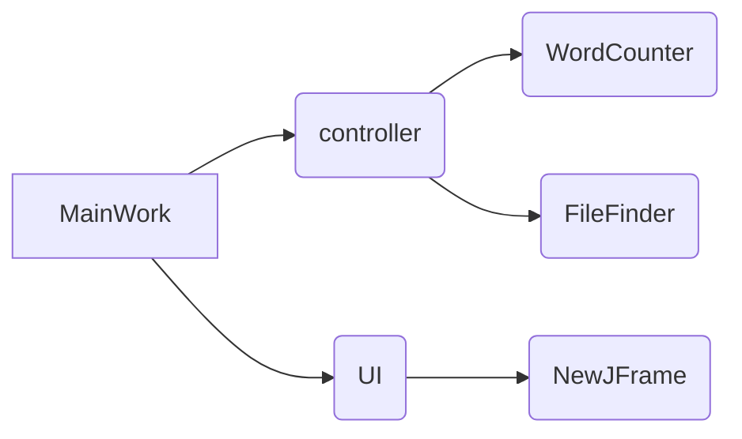
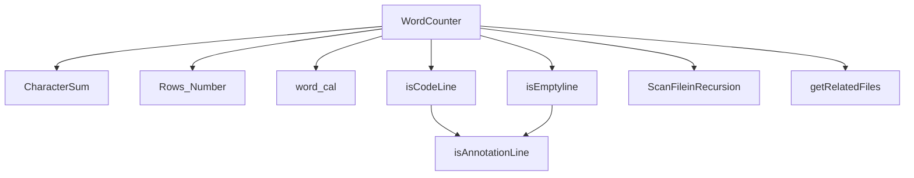

# Implementation of WC in JAVA

[github地址 ](https://github.com/laomi233/wordcount)

## 相关要求 

- **基本功能** 

  1. -c   [文件名]     返回文件的字符数    （实现）
  2. -w  [文件名]     返回文件的词的数目 （实现）
  3. -l    [文件名]     返回文件的行数        （实现）

- **扩展功能** 

  1. -s   递归处理目录下符合条件的文件。            （实现）
  2. -a   返回更复杂的数据（代码行/空行/注释行）（实现）
  3. 支持各种文件的通配符（*,?）                          （实现）

- **高级功能**   

  1.支持图形化界面      （实现）

------

# PSP 

| PSP2.1                                  | Personal Software Process Stages        | 预估耗时（分钟） | 实际耗时（分钟） |
| --------------------------------------- | --------------------------------------- | ---------------- | ---------------- |
| Planning                                | 计划                                    |                  |                  |
| · Estimate                              | · 估计这个任务需要多少时间              | 30               | 35               |
| Development                             | 开发                                    |                  |                  |
| · Analysis                              | · 需求分析 (包括学习新技术)             | 180              | 120              |
| · Design Spec                           | · 生成设计文档                          | 120              | 60               |
| · Design Review                         | · 设计复审 (和同事审核设计文档)         | 60               | 40               |
| · Coding Standard                       | · 代码规范 (为目前的开发制定合适的规范) | 100              | 60               |
| · Design                                | · 具体设计                              | 180              | 120              |
| · Coding                                | · 具体编码                              | 300              | 360              |
| · Code Review                           | · 代码复审                              | 60               | 30               |
| · Test                                  | · 测试（自我测试，修改代码，提交修改）  | 120              | 60               |
| Reporting                               | 报告                                    | 60               | 30               |
| · Test Report                           | · 测试报告                              | 60               | 60               |
| · Size Measurement                      | · 计算工作量                            | 60               | 30               |
| · Postmortem & Process Improvement Plan | · 事后总结, 并提出过程改进计划          | 20               | 15               |
| 合计                                    |                                         | 1290             | 1020             |

------

# 设计说明





- MainWork: 通过输入的参数来调用模块WordCounter中的方法实现基本要求和扩展要求，以及调用实现高级要求中的图形化界面

- controller: 基本功能与扩展功能模块包

- Word Counter：实现-c 统计文件字符数方法，实现-w 统计文件单词数方法，实现-l 统计文件行数，以及实现 -a中统计文件注释行，代码行，空行和-s的递归处理目录下文件的命令参数。

- FileFinder：实现支持处理文件名通配符

- UI（图形界面）：NewJFrame 是为了实现处理-x参数传入时所设计的JAVA Swing图形化界面

  ------

# 解题思路与关键代码


## 代码 

1. -c 统计文件字符数

   **解题思路** -FileReader读入文件，读入时计数器同时递增即可记录文件字符数目，单文件不存在计数器置为-1，与空文件区别开

   ```java
     public static int CharacterSum(File file) throws IOException {
           int count_Char = 0;
           if(!file.exists())
           {
               count_Char = -1;
               return count_Char;
           }
           FileReader fr = new FileReader(file);
           while(fr.read()!=-1)
           {
               count_Char++;
           }
           return count_Char;
   
       } 
   ```

2. -l 统计文件行数

   **解题思路** 通过文件读入方式以字符缓冲输入流读入，缓冲字符，从而实现以行读取并计数器计算出行数，文件不存在时同上处理

   ```java
    public static int Rows_number(File file) throws IOException {
           int count_Row = 0;
           if(!file.exists())
           {
               count_Row = -1;
           }
           else
           {
               FileReader fr = new FileReader(file);
               BufferedReader br = new BufferedReader(fr);
   
               String s = null;
               while((s=br.readLine())!=null)
               {
                   count_Row++;
               }
           }
           return count_Row;
       }
   ```

3. -w 统计文件单词数

   **解题思路** 学习了正则表达式，readLine每行读入文件与正则表达式匹配从而计算出单词数，文件不存在同上处理

   ```java
   public static int word_cal(File file) throws IOException {
           int count_Word = 0;
           if(!file.exists())
           {
               count_Word = -1;
           }
           else
           {
               FileReader fr = new FileReader(file);
               BufferedReader br = new BufferedReader(fr);
               String s = null;
               while((s=br.readLine())!=null)
               {
                   String reg = "\\d+.\\d+|\\w+";
                   Matcher mat = Pattern.compile(reg).matcher(s);
                   while(mat.find())
                   {
                       count_Word++;
                   }
   
               }
           }
           return count_Word;
       }
   
   ```

4. -a 统计文件空行，代码行，注释行

   **解题思路与代码**  

   - 空行统计：根据需求，空行不得多于一个可显示字符，readLine读入文件每行字符串.trim()去掉空格和格式控制符,若字符串长度不大于1则空行计数器加一，文件不存在同上处理

   ```java
   public static int isEmptyLine(File file) throws IOException {
           int count_EmptyLine = 0;
           if(!file.exists())
           {
               count_EmptyLine = -1;
           }
           else
           {
   
               FileReader fr = new FileReader(file);
               BufferedReader br = new BufferedReader(fr);
               String s = null;
               while((s=br.readLine())!=null)
               {
                   if(s.trim().length()<=1){
                       count_EmptyLine++;
                   }
               }
   
           }
           return count_EmptyLine;
       }
   ```

   - 代码行统计：将文件readLine读入，每行字符串.trim()去掉空格，格式控制符之后通过正则表达式将注释符号//、/**/等匹配并删除，并对某些特殊情况进行处理，保留换行符，并append到StringBuffer中，最后将StringBuffer放入一个字符缓冲器当中并统计行数，即可得出代码行数目。文件不存在同上处理

   ```java
    public static int isCodeLine(File file) throws IOException {
           int count_CodeLine = 0;
           if(!file.exists())
           {
               count_CodeLine = -1;
           }
           else {
               FileReader fr = new FileReader(file);
               BufferedReader br = new BufferedReader(fr);
               String s = null;
               Pattern p = Pattern.compile("\\/\\/[^\\n]*|\\/\\*([^\\*^\\/]*|[\\*^\\/*]*|[^\\**\\/]*)*\\*+\\/");
               String tmp = null;
               StringBuffer sb = new StringBuffer();
               String target = null;
               while ((s = br.readLine()) != null) {
                   s = s.trim();
                   int flag = 0;
                   int pos = 0;
                   for (int i = 1; i < s.length(); i++) {
                       if ((i+1)<s.length()-1&&s.charAt(i) == '/' && (s.charAt(i + 1) == '/' || s.charAt(i + 1) == '*')) {
                           pos = i;
   
                           if(s.charAt(i)=='/'&&s.charAt(i+1)=='/')
                           {
                               sb.append(s,0,i);
                               sb.append("\n");
                           }
                           else if(s.charAt(i+1)=='*'&& !s.substring(i).contains("*/"))
                           {
                               String t = (String) s.subSequence(0, i);
                               sb.append(t);
                               sb.append("\n");
                               sb.append(s.substring(i));
                               sb.append("\n");
                           }
                           else if(s.charAt(i+1)=='*'&& s.substring(i).contains("*/"))
                           {
                               Matcher m = p.matcher(s);
                               tmp = m.replaceAll("");
                               sb.append(tmp);
                               sb.append("\n");
                               flag = 1;
                               break;
                           }
                           flag = 1;
   
                       }
   
                   }
                   if (flag == 0) {
                       if (s.length() > 1 && s.substring(0, 1).equals("*/")) {
                   
                           sb.append("*/");
                           sb.append("\n");
                           sb.append(s.substring(2));
                           sb.append("\n");
                       } else {
                           sb.append(s);
                           sb.append("\n");
   
                   }
                       }
   
                   }
               }
               br.close();
               target = sb.toString();
               Matcher mat = p.matcher(target);
               String res = null;
               res = mat.replaceAll("");
               BufferedReader context = new BufferedReader(new StringReader(res));
               while((tmp=context.readLine())!=null)
               {
   
                   if(tmp.trim().length()>1)
                   {
                       count_CodeLine++;
                   }
               }
   
           }
           return count_CodeLine;
       }
   
   ```

   - 注释行数目：通过以上对总行数，空行数，代码行数目的计算，则可以通过调用以上方法可得出注释行数目=总行数-空行数-代码行数目

   ```java
           public static int isAnnotationLine(File file) throws IOException {
               int count_Annotation = 0;
               if(!file.exists())
               {
                   count_Annotation = -1;
               }
               else
               {
                   count_Annotation = Rows_number(file) - isEmptyLine(file) - isCodeLine(file);
               }
               return count_Annotation;
           }
   ```

5. -s  递归处理目录下符合条件的文件。

   **解题思路** 将非根目录文件夹的文件路径名通过递归方法放入List中

   ```java
    public static List<String> ScanFileInRecursion(File file)
       {
   
           if(!file.isDirectory())
           {
               System.out.println("非合法目录文件夹！请重新输入！");
           }
           else
           {
               File[] files = file.listFiles();
               for(int i=0;i<files.length;i++)
               {
                   if(files[i].isDirectory())
                   {
   
                       ScanFileInRecursion(files[i]);
                   }
                   else
                   {
                       System.out.println(files[i].getAbsolutePath());
                       filepath.add(files[i].getAbsolutePath());
                   }
               }
   
           }
           return filepath;
       }
   ```

6. 支持各种文件的通配符（*,?）

   **解题思路**  使用的是JDK 1.7，Files.walkFileTree，经过学习发现比File类的遍历效率要高很多，FileFinder类继承FileVisitor适配器SimpleFileVisitor<Path>，在编程设计中，Glob是一种模式，使用通配符来指定文件名，例如*.java，在Glob模式广泛使用通配符\* 和 ？，通过files.walktreefile和NIO库中的glob模式，则可以遍历找出相关文件从而支持文件通配符

   FileFinder：

   ```java
   public class FileFinder extends SimpleFileVisitor<Path> {
       private final PathMatcher matcher;
       private List<Path> matchedPaths = new ArrayList<Path>();
       private List<Path> matchedAbPaths = new ArrayList<Path>();
       FileFinder(String pattern)
       {
           matcher = FileSystems.getDefault().getPathMatcher("glob:"+ pattern);
       }
   
       void match(Path file)
       {
           Path name = file.getFileName();
           if(name!=null && matcher.matches(name)){
               matchedPaths.add(name);
   
               matchedAbPaths.add(file.toAbsolutePath());
           }
       }
       @Override
       public FileVisitResult visitFile(Path file,BasicFileAttributes attrs)
       {
           match(file);
           return  CONTINUE;
       }
   
       @Override
       public FileVisitResult preVisitDirectory(Path dir, BasicFileAttributes attrs)
       {
           match(dir);
           return CONTINUE;
       }
   
       @Override
       public FileVisitResult visitFileFailed(Path file, IOException exc)
       {
           System.err.println(exc);
           return  CONTINUE;
       }
       public int getTotalMatches()
       {
           return matchedPaths.size();
       }
       public Collection<Path> getMatchedPaths()
       {
           return matchedPaths;
       }
       public List<Path> getMatchedAbPaths()
       {
           return matchedAbPaths;
       }
       
   }
   ```

   WordCounter的getRelatedFiles方法：

   ```java
           public static List<Path> getRelateFiles(String filepath) throws IOException {
               FileFinder finder = new FileFinder(filepath);
               Files.walkFileTree(Paths.get(System.getProperty("user.dir")),finder);
   
               Collection<Path> Absolutematched = finder.getMatchedAbPaths();
               return (List<Path>) Absolutematched;
   }
   ```

7. -x 图形化界面功能

   **解题思路** 根据Java的Swing设计界面，通过filechooser来选择文件进行wordcount功能演示。

   界面设计部分具体太多则不贴出，下面只贴按钮监听事件部分：

   ```java
   private void jButton1ActionPerformed(java.awt.event.ActionEvent evt) throws IOException, IOException {
           // TODO add your handling code here:
           jTextArea1.setText("");
           JFileChooser jfc=new JFileChooser();
           jfc.setFileSelectionMode(JFileChooser.FILES_AND_DIRECTORIES );
           jfc.showDialog(new JLabel(), "选择");
           File file=jfc.getSelectedFile();
           if(file.isDirectory()){
               System.out.println("文件夹:"+file.getAbsolutePath());
           }else if(file.isFile()){
               System.out.println("文件:"+file.getAbsolutePath());
           }
           System.out.println(jfc.getSelectedFile().getName());
           BufferedReader br = new BufferedReader(new FileReader(file));
           String s = null;
           while((s=br.readLine())!=null)
           {
               jTextArea1.append(s+"\n");
           }
   
           br.close();
           int char_count = CharacterSum(file);
           int word_count = word_cal(file);
           int line_cunt = Rows_number(file);
           int empty_line = isEmptyLine(file);
           int code_line = isCodeLine(file);
           int annotate_line = isAnnotationLine(file);
   
           if(char_count==-1||word_count==-1||line_cunt==-1||empty_line==-1||code_line==-1||annotate_line==-1)
           {
               chara.setText("字符数：0");
               jLabel2.setText("单词数：0");
               jLabel3.setText("总行数：0");
               jLabel4.setText("空行数：0");
               jLabel5.setText("注释行：0");
               jLabel6.setText("代码行：0");
           }
           else{
               chara.setText("字符数： "+char_count);
               jLabel2.setText("单词数： "+word_count);
               jLabel3.setText("总行数： "+line_cunt);
               jLabel4.setText("空行数： "+empty_line);
               jLabel5.setText("注释行： "+annotate_line);
               jLabel6.setText("代码行： "+code_line);
           }
   
       }
   ```


------

# 测试

命令行输入参数测试-c -w -l -a:


测试-s：

测试 -x:

测试文本文件：

```
#include<bits/stdc++.h>
using namespace std;

typedef long long ll;
const int mod = 1e9+7;
void exgcd(ll a,ll b,ll &x,ll &y)
{
	/*
		欧几里得 
	*/
	if(b==0)
	{
		x = 1;
		y = 0;
		return ;
	}
	ll x1,y1;
	exgcd(b,a%b,x1,y1);
	x = y1;
	y = x1-(a/b)*y1;
}
int main()
{
	//code here 
	ll n,m;
	while(cin>>n>>m)
	{
		ll res = 1;
		for(ll i=1;i<=n+m-4;i++)
			res  = (res*i)%mod;
		for(ll i=1;i<=n-2;i++)
		{
			ll x,y;
			exgcd(i,mod,x,y);
			x = (x%mod+mod)%mod;
			res = (res*x)%mod;
		}
		for(ll i=1;i<=m-2;i++)
		{
			ll x,y;
			exgcd(i,mod,x,y);
			x = (x%mod+mod)%mod;
			res = (res*x)%mod;
		}
		res = (res%mod+mod)%mod;
		cout<<res<<endl;
	}
	return 0;
}
```

------

# 代码覆盖率


------

# 小结

在设计完成该项目的时候收获很多，认识到对自己个人项目的设计的不足，包括时间的分配不科学，以及设计过程中对某些细节没有仔细考虑清楚，就开始着手程序，导致后面做了很多调整，让我觉得以后自身在学习开发时要多在前期设计下多点功夫。同时深刻了解到自己代码的不规范所带的问题。这次课程项目的开发用到了Java开发，过程中也学习到了不少新的东西，对以前学的东西有了进一步的了解，包括对如何通配符支持的研究和对正则表达式的深一步理解运用。希望自己能够在以后的项目设计和编写中通过学习和反省从而达到高效。
